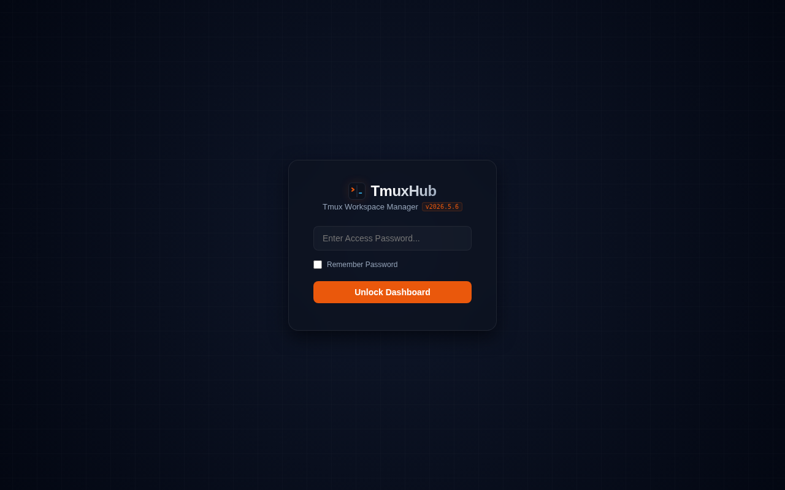
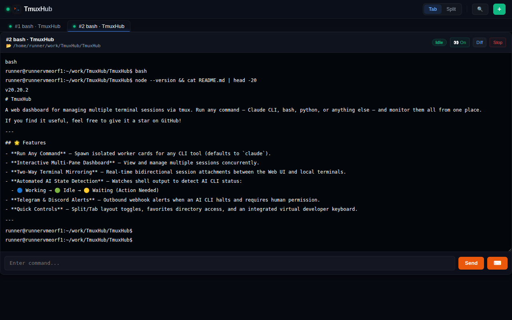
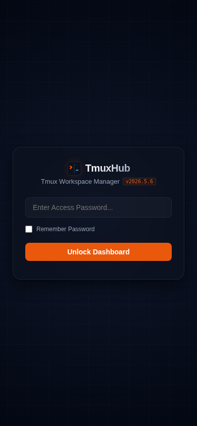
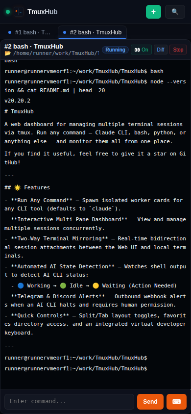

# TmuxHub

A web dashboard for managing multiple terminal sessions via tmux. Run any command — Claude CLI, bash, python, or anything else — and monitor them all from one place.

If you find it useful, feel free to give it a star on GitHub!

---

## 📸 Screenshots

### Desktop

| Login | Dashboard |
|-------|-----------|
|  |  |

### Mobile

| Login | Dashboard |
|-------|-----------|
|  |  |

---

## 🖥️ Tmux Usage

TmuxHub uses **tmux** under the hood to create and manage isolated terminal sessions.

### Attach to a running session

Every worker spawned from the dashboard corresponds to a named tmux session (`term-<id>`). You can attach to it directly from your terminal:

```bash
# List all TmuxHub sessions
tmux ls | grep term-

# Attach to a specific worker (e.g. worker id 1)
tmux attach -t term-1

# Detach and return to TmuxHub without stopping the session
# (inside tmux) press: Ctrl+B  then  D
```

### Common tmux commands while attached

| Action | Keys |
|--------|------|
| Detach from session | `Ctrl+B` → `D` |
| Scroll up in output | `Ctrl+B` → `[` (then arrow keys; `Q` to quit) |
| Kill/close session | `exit` or `Ctrl+D` in the shell |

### Manual session management

```bash
# Create a new session manually (TmuxHub will pick it up on reload)
tmux new-session -d -s term-5 -c ~/projects "claude"

# Send a keystroke to a session without attaching
tmux send-keys -t term-1 "ls -la" Enter

# Kill a session
tmux kill-session -t term-1
```

> **Tip:** Sessions created manually with the `term-<id>` naming convention are automatically recovered by TmuxHub on server restart.

---

## 🌟 Features

- **Run Any Command** — Spawn isolated worker cards for any CLI tool (defaults to `claude`).
- **Interactive Multi-Pane Dashboard** — View and manage multiple sessions concurrently.
- **Two-Way Terminal Mirroring** — Real-time bidirectional session attachments between the Web UI and local terminals.
- **Automated AI State Detection** — Watches shell output to detect AI CLI status:
  - 🔵 Working → 🟢 Idle → 🟡 Waiting (Action Needed)
  - 🎛️ **Monitor Mode Selector** — Choose `Off`, `Monitor Only`, or `Auto Mode` per worker.
  - ⚡ **Auto Mode** — Sends `y` (or `1` when prompts display `1. yes`) and auto-selects `1. Stop and wait for limit to reset` for `/rate-limit-options`.
  - ♻️ **Rate-Limit Auto-Recovery** — When reset time is parseable, waiting workers auto-return to running; Auto Mode sends `continue` after reset.
- **Telegram & Discord Alerts** — Outbound webhook alerts when an AI CLI halts and requires human permission.
- **Quick Controls** — Split/Tab layout toggles, favorites directory access, an integrated virtual developer keyboard, and terminal log scroll lock for freeze-frame history reading.

---

## 📋 Prerequisites

- **[Node.js](https://nodejs.org) 22+**
- **[tmux](https://github.com/tmux/tmux)**

---

## 🚀 Quick Start (Minimal Setup)

### 1. Clone & Install
```bash
git clone https://github.com/zr0aces/TmuxHub.git
cd TmuxHub
npm install
```

### 2. Configure Environment
```bash
cp .env.example .env
cp config.example.json config.json
```
Ensure your `.env` contains a secure entry password:
```env
PORT=8081
DASHBOARD_PASSWORD=your-secret-password-here
SESSION_TTL_MS=604800000
TRUST_PROXY=0
```

`TRUST_PROXY=1` should only be enabled behind a trusted reverse proxy.

### 3. Launch Server
```bash
npm start
```
Open your browser at **`http://localhost:8081`** to log in!

---

## 📚 Detailed Documentation

Detailed deployment guides and configurations have been moved to the [docs/](docs/) directory:

* **[Installation & Deployment Guide](docs/installation.md)** — Step-by-step setup guides for macOS daemon (`launchd`), Ubuntu/Debian services, Docker Compose setups, and Cloudflare Secure Tunnels.
* **[User Guide & Dashboard Usage](docs/usage.md)** — Learn how to log in, scan/attach existing sessions, leverage bidirectional mirroring, and interact with the virtual mechanical keyboard.
* **[AI State Monitoring & Alerts Setup](docs/ai_monitoring.md)** — Setup guide for configuring Telegram outbound alerts, tuning idle thresholds, and modifying regex patterns.
* **[Technical Specification](docs/technical_spec.md)** — In-depth architectural details, client-server data flows, security mechanisms, and core capability implementations of TmuxHub.
* **[Technical Requirements](docs/technical_requirements.md)** — Prerequisites, system requirements, network ports, permissions, and browser compatibility checklists.
* **[User & Functional Requirements](docs/user_requirements.md)** — Core user workflows when starting projects and a comprehensive workspace feature catalog.

---

## 📂 File Structure

```text
tmuxhub/
├── docs/                  # Detailed documentation guides
│   ├── installation.md    # Environments, systemd/launchd, tunnels
│   ├── usage.md           # Dashboard user guide & tmux commands
│   └── ai_monitoring.md   # Supervision engine & Telegram setup
├── server.js              # Node.js server (tmux management, WebSocket)
├── index.html             # Web UI entry point
├── setup.sh               # One-step macOS setup script
├── lib/
│   ├── patternEngine.js   # Regex wait-state detection
│   ├── watcherEngine.js   # Poll loop + state transitions
│   ├── telegramService.js # Outbound Telegram notifications
│   └── sessionStateManager.js # Metadata persistence & debouncing
├── public/
│   ├── style.css          # Styles
│   └── js/
│       ├── layout.js      # Layout & tab management
│       ├── favorites.js   # Favorites & path management
│       ├── ws.js          # WebSocket communication
│       ├── workers.js     # Worker card UI rendering
│       └── app.js         # Init & event binding
├── config.example.json    # User config template
└── .env.example           # Environment variables template
```

---

## 🤝 Thanks

Special thanks to the original creator [sunmerrr/TermHub](https://github.com/sunmerrr/TermHub) for the inspiration and foundation of this project.

---

## 📄 License

MIT
