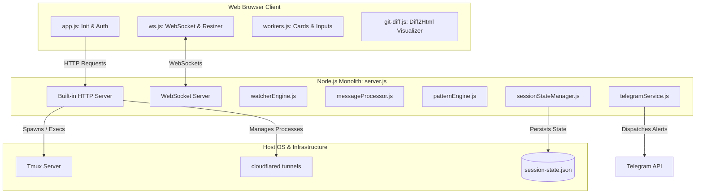
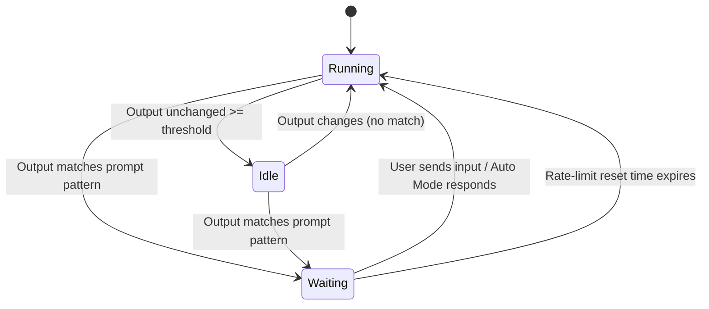

# TmuxHub Technical Specification

This document provides a detailed technical specification of the **TmuxHub** workspace manager. It outlines the architecture, data flow, security model, core components, and deployment mechanics of the system.

---

## 1. System Overview

TmuxHub is a lightweight, real-time developer terminal dashboard and workspace manager. It is designed to host, monitor, and interact with multiple long-running CLI tools (such as `claude` CLI, bash shells, or build scripts) within isolated, native `tmux` sessions. 

### Key Features
* **Native Tmux Execution**: Seamless bidirectional mirroring between the web console and host terminals.
* **AI wait-state Supervision**: A state machine that tracks shell output patterns and transitions workers between `running`, `idle`, and `waiting` states.
* **Rate-Limit Auto-Recovery**: Automated extraction of rate-limit reset times with scheduled resume triggers (sending input keys to tmux panes when time limits expire).
* **Secure Session Mirroring**: HTTP Cookie token-based authentication and secure password encryption within client-side browser database storage.

---

## 2. System Architecture

TmuxHub is designed as a zero-framework, low-dependency client-server application. 



### 2.1 Backend Server (`server.js`)
The backend server (`server.js`) acts as the central router and coordinator. It integrates the modular services from `lib/` using core standard libraries (`http`, `net`, `fs`, `path`).
* **HTTP Server**: Serves static frontend assets (`index.html`, client JS, and CSS) and handles REST API requests.
* **WebSocket Server (via `ws`)**: Manages active connections, broadcasting shell logs, worker status, CWD changes, and tunnel URLs to clients.
* **State Management**: Orchestrates worker states and references configuration/active sessions across user interactions.

### 2.2 Server-Side Helper Modules (`lib/`)
The backend relies on isolated modules to implement specialized logic, subprocess bindings, security, and alerts:
1. **`tmuxService.js`**: Contains native `tmux` subprocess execution bindings (`tmuxExec`, `tmuxExecAsync`, `isAlive`) and safety name validation (`sanitizeSessionName`), keeping terminal execution details decoupled from routing.
2. **`authService.js`**: Manages HTTP session creation, cookie signing, timed session-pruning, security matching (`timingSafePasswordMatch`), and IP-based rate limiting to prevent brute-force attacks.
3. **`patternEngine.js`**: Core regular expression analyzer. Compiled regexes check shell history to detect active requests or rate-limit warnings. It parses complex reset strings (relative times like `3h 15m` or absolute timestamps like `12:20am (Asia/Bangkok)`) into UTC milliseconds.
4. **`watcherEngine.js`**: Monitors output differences over time. If a session is quiet, it transitions the worker's status from `running` to `idle` after the configured threshold.
5. **`messageProcessor.js`**: Analyzes text layout cues (e.g. Yes/No questions `[y/N]`, numbered menus `1. Option`, and key requests) to formulate auto-responses for Auto Mode.
6. **`sessionStateManager.js`**: Serializes worker configurations, activity logs, and rate-limit timers. Persists states to `state/session-state.json` via a debounced, 500ms delay write queue.
7. **`telegramService.js`**: Connects to the Telegram Bot API to deliver alerts when workers stall.

### 2.3 Frontend Client (`public/`)
The frontend is written in vanilla ES6 JavaScript and HTML5/CSS3. It does not pull in major frameworks (like React or Vue) to keep loads fast and latency low.
* **`app.js`**: Controls the login view and routes user interactions. Hooks into global keydowns to feed typing inputs directly to active sessions.
* **`ws.js`**: Configures the WebSocket connection and measures terminal dimensions using a dummy DOM character span to adjust the server-side tmux pane layout dynamically.
* **`workers.js`**: Generates high-density cards for active sessions, updating logs, virtual keys, scroll logs, and supervisors.
* **`git-diff.js`**: Communicates with `/api/git-diff` and renders visual diffs using the CDN-delivered `diff2html` library.
* **`ansi.js`**: Converts raw ANSI escape sequences into styled, theme-compliant HTML elements.

---

## 3. Communication Protocols & Data Flow

### 3.1 REST API Reference
All REST API endpoints require session cookie validation, except `/api/login`.

| Endpoint | Method | Payload | Response | Description |
| :--- | :--- | :--- | :--- | :--- |
| `/api/login` | POST | `{ pw: string }` | `{ ok: boolean }` | Checks password; issues `token` cookie on success. |
| `/api/config` | GET | None | Config JSON object | Returns `basePath`, `favorites`, `defaultCommand`, and monitor configurations. |
| `/api/workers` | GET | None | Array of worker objects | Returns all active sessions, recent logs, statuses, and monitor metadata. |
| `/api/scan` | GET | None | Array of discovered sessions | Inspects running host processes for untracked `term-*` tmux sessions. |
| `/api/attach` | POST | `{ sessionName, cwd }` | `{ id: string }` | Imports an untracked tmux session onto the dashboard. |
| `/api/spawn` | POST | `{ cwd, cmd }` | `{ ok: boolean, id: string }` | Spawns a new tmux session and initiates monitoring. |
| `/api/input` | POST | `{ id, text }` | `{ ok: boolean }` | Sends characters and a newline key down to a worker pane. |
| `/api/key` | POST | `{ id, key }` | `{ ok: boolean }` | Fires specialized tmux keystrokes (e.g. `C-c`, `Escape`, `Tab`). |
| `/api/reconnect` | POST | `{ id }` | `{ ok: boolean }` | Restarts monitoring loops on disconnected or dead tmux sessions. |
| `/api/remove` | POST | `{ id }` | `{ ok: boolean }` | Destroys dashboard tracking. |
| `/api/kill` | POST | `{ id }` | `{ ok: boolean }` | Issues a `kill-session` command to terminate the target tmux instance. |
| `/api/set-monitor-mode`| POST| `{ id, mode }` | `{ ok: boolean, mode: string }`| Configures supervision mode (`off`, `monitor`, or `auto`). |
| `/api/git-diff` | GET | `?id={id}&file={path}` | Diff data or file list | Returns git status change lists or concrete code changes. |
| `/api/tunnel` | GET | None | `{ url: string }` | Retrieves the primary dashboard public tunnel URL. |

### 3.2 WebSocket Events
Real-time messages are transmitted as JSON packets over a single WebSocket connection.

#### Server-to-Client Broadcasts
* **`spawned`**: Broadcast when a worker session is created or attached.
  ```json
  { "type": "spawned", "id": "1", "cwd": "/projects", "cmd": "claude", "status": "running" }
  ```
* **`log`**: Emitted when input data is forwarded to the shell.
  ```json
  { "type": "log", "id": "1", "src": "stdin", "text": "y", "ts": 1716200000000 }
  ```
* **`status`**: Broadcast when a worker state changes (e.g. `completed` or `stopped`).
  ```json
  { "type": "status", "id": "1", "status": "completed", "reason": "Exit code 0" }
  ```
* **`cwd`**: Dispatched when a worker traverses to a different directory.
  ```json
  { "type": "cwd", "id": "1", "cwd": "/projects/subfolder" }
  ```
* **`aiState`**: Broadcast when the wait-state changes (`running`, `idle`, or `waiting`).
  ```json
  { "type": "aiState", "id": "1", "state": "waiting" }
  ```
* **`monitorMeta`**: Emitted to refresh UI supervisor summaries.
  ```json
  { "type": "monitorMeta", "id": "1", "waitingState": "waiting", "lastActivityAt": "...", "lastMatchedPattern": "token_limit" }
  ```

* **`snapshot`**: Sends full-pane output updates (up to 500 lines) during polling intervals.
  ```json
  { "type": "snapshot", "id": "1", "lines": ["line 1", "line 2", "..."] }
  ```

#### Client-to-Server Messages
* **`resize`**: Adjusts standard row and column parameters on the backend tmux terminal.
  ```json
  { "type": "resize", "id": "1", "cols": 120, "rows": 40 }
  ```
* **`active`**: Alerts the backend that the client window is active.
  ```json
  { "type": "active" }
  ```

---

## 4. Core Capabilities & Mechanics

### 4.1 Native Tmux Integration
TmuxHub interacts directly with the system's `tmux` binary. When spawning a worker, it invokes:
```bash
tmux new-session -d -s term-{id} -c {cwd} -e "CLAUDECODE="
tmux send-keys -t term-{id} "{cmd}" Enter
```
* **Output Polling**: Every second (configurable), the server runs:
  ```bash
  tmux capture-pane -t term-{id} -p -S -500 -J
  ```
  to read the pane's text content.
* **CWD Tracking**: The active path is discovered via:
  ```bash
  tmux display-message -t term-{id} -p "#{pane_current_path}"
  ```
* **Keystroke Delivery**: Key events are mapped to the pane using safe command arrays:
  ```javascript
  // For standard strings
  tmuxExec("send-keys", "-t", sessionName, text);
  // For special key actions
  tmuxExec("send-keys", "-t", sessionName, "C-c");
  ```

### 4.2 Wait-State Detection Engine
The Wait-State detection system scans terminal output captures at configured intervals.



* **Transition to Idle**: If the capture output remains identical to the previous capture for more than the threshold (`AI_MONITOR_IDLE_THRESHOLD_MS`, default 5000ms), the state becomes `idle`.
* **Transition to Waiting**: If the tail output matches any regular expression compiled in `lib/patternEngine.js` (like `/confirm\?/i` or `/\\[y\/N\\]/i`), the state transitions to `waiting`.
* **Auto Mode Processing**: If Auto Mode is active and the matched pattern defines a resolution (e.g., `yesOption` keys, `y`, or `1` for list select), the processor automatically runs `sendInput(id, response)` and logs the event.
* **Notification Debouncing**: To prevent notification spam, a state key is generated using:
  ```javascript
  const key = `${sessionName}::${patternName}::${hashText(matchedText + "\n" + excerpt)}`;
  ```
  If this key has already been flagged, the server skips sending duplicate Telegram alerts.

### 4.3 Rate-Limit Recovery System
If the matched wait-state belongs to a rate limit signature (e.g. `usage_limit` or `rate_limited` in `lib/messageProcessor.js`), the engine extracts the reset parameter using:
```javascript
const RESET_TIME_RE = /(?:try(?:\s+again)?(?:\s+in)?|resets?(?:\s+(?:in|at))?|available(?:\s+again)?\s+in|come\s+back\s+in|limit\s+resets?(?:\s+(?:in|at))?)\s+([0-9a-z][^.\n!?]{2,80}?)(?:\s*[.!\n]|$)/i;
```
1. **Relative Parsing**: Values like `2 hours` or `45 minutes` are converted into millisecond durations and added to `Date.now()`.
2. **Absolute Parsing**: Times like `11:00 AM PST` or `12:20am (Asia/Bangkok)` are resolved using built-in timezone offset lists. Standard IANA timezones are resolved using `Intl.DateTimeFormat` timezone offsets.
3. **Execution Recovery**: A UTC epoch timestamp `resetAtEpochMs` is calculated and saved. When `Date.now() >= resetAtEpochMs`, the server resets the wait-state and inputs `"continue"` into the tmux pane to resume.

### 4.4 Git Diff Side-Panel
The side-panel displays changes within the active workspace directory:
1. **File Status Listing**: Queries the directory state:
   ```bash
   git -C {cwd} status --porcelain
   ```
   Statuses mapped: `M` (Modified), `A` (Added), `D` (Deleted), `R` (Renamed).
2. **Generating Diff**: Fetches changes for the selected file:
   ```bash
   git -C {cwd} --no-color diff HEAD -- {file}
   ```
   If no commit history (`HEAD`) exists, it falls back to:
   ```bash
   git -C {cwd} --no-color diff -- {file}
   ```
3. **Visual Render**: The diff string is processed on the client side using the `diff2html` JS library to generate side-by-side or line-by-line colored diffs.

---

## 5. Security Model & Safeguards

TmuxHub implements several security measures to protect the host system:

* **Authentication**: Password matches are verified on the server using `crypto.timingSafeEqual` to block timing attacks. Successful log-ins return a cookie with `HttpOnly; SameSite=Strict; Path=/` flags.
* **IP Rate Limiting**: Login submissions are tracked in-memory. If a single IP address commits more than 20 incorrect password submissions within a 10-minute window, subsequent login requests are blocked.
* **Input Sanitization**: Session arguments, CWD targets, and terminal keys are executed using `execFileSync` (passing arguments in a structured string array) rather than standard shell strings to prevent command injections. Session names are checked against `^[a-zA-Z0-9_:-]+$`.
* **Path Traversal Protection**: REST API file lookups (like `/api/git-diff`) check parameters to ensure paths do not contain parent directory markers (`..`).
* **WebCrypto Password Encryption**: Remembered password credentials are encrypted in IndexedDB using AES-GCM 256. Cryptographic keys are generated and held within a secure database store, preventing simple extraction from plain localStorage dumps.

---

## 6. Installation & Deployment Configurations

TmuxHub supports three principal deployment models.

### 6.1 macOS Launchd Daemon
Spins up the server as a background user daemon (`~/Library/LaunchAgents/com.tmuxhub.server.plist`):
```xml
<?xml version="1.0" encoding="UTF-8"?>
<!DOCTYPE plist PUBLIC "-//Apple//DTD PLIST 1.0//EN" "http://www.apple.com/DTDs/PropertyList-1.0.dtd">
<plist version="1.0">
<dict>
    <key>Label</key>
    <string>com.tmuxhub.server</string>
    <key>ProgramArguments</key>
    <array>
        <string>/usr/local/bin/node</string>
        <string>/absolute/path/to/TmuxHub/server.js</string>
    </array>
    <key>RunAtLoad</key>
    <true/>
    <key>KeepAlive</key>
    <true/>
    <key>StandardOutPath</key>
    <string>/tmp/tmuxhub.log</string>
    <key>StandardErrorPath</key>
    <string>/tmp/tmuxhub.log</string>
</dict>
</plist>
```

### 6.2 Linux Systemd Services

#### Option A: System Service (`/etc/systemd/system/tmuxhub.service`)
Used for machine-wide, multi-user deployments:
```ini
[Unit]
Description=TmuxHub Dashboard Server
After=network.target

[Service]
Type=simple
User=tmuxhub-user
Group=tmuxhub-user
WorkingDirectory=/opt/TmuxHub
ExecStart=/usr/bin/npm start
Restart=on-failure
RestartSec=3
Environment=NODE_ENV=production

[Install]
WantedBy=multi-user.target
```

#### Option B: User Service (`~/.config/systemd/user/tmuxhub.service`)
Allows non-root users to execute and control the service:
```ini
[Unit]
Description=TmuxHub Dashboard Server (User Service)
After=default.target

[Service]
Type=simple
WorkingDirectory=/home/user/TmuxHub
ExecStart=/usr/bin/npm start
Restart=on-failure
RestartSec=3
Environment=NODE_ENV=production

[Install]
WantedBy=default.target
```

### 6.3 Docker Compose
Containerized deployment utilizing standard bind-mount volumes:
```yaml
services:
  tmuxhub:
    build: .
    container_name: tmuxhub
    restart: unless-stopped
    ports:
      - "8081:8081"
    environment:
      - PORT=8081
      - DASHBOARD_PASSWORD=your_secure_password
      - SESSION_TTL_MS=604800000
    volumes:
      - ./config.json:/app/config.json
      - ./state:/app/state
      - /var/run/tmux:/var/run/tmux
```
