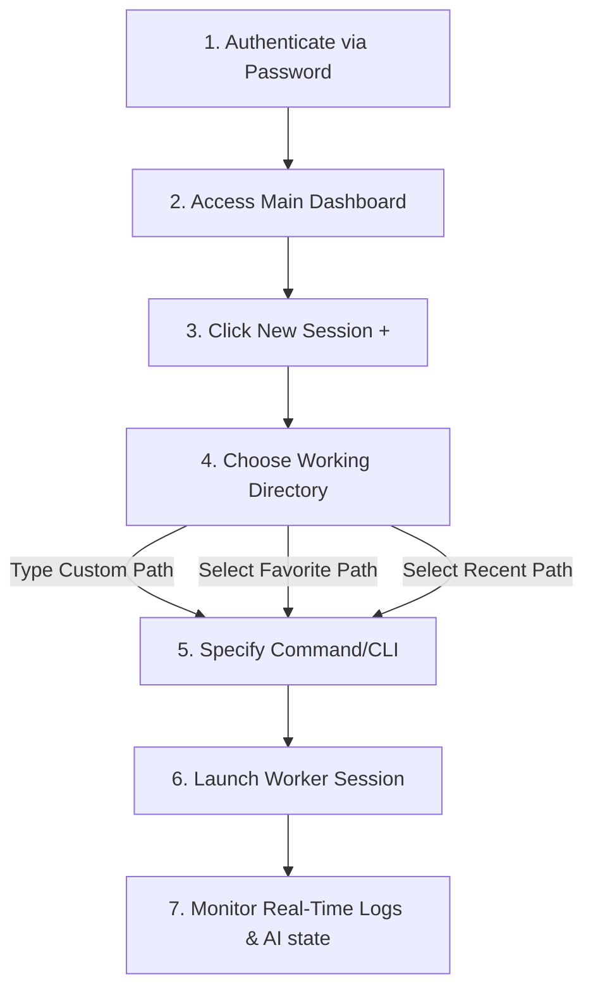

# TmuxHub User Requirements & Functional Catalog

This document defines the user requirements, functional workflows when starting or attaching a project, and the complete feature catalog required for the TmuxHub dashboard.

---

## 1. User Workflows when Starting a Project

When a user initiates work on a new codebase or tool, the dashboard must guide them through the following sequence:

1. **Authentication**: Access is blocked until the user submits the configured dashboard password.
2. **Directory Selection (CWD)**: The user provides the base path where the project resides. To streamline this step, the user must be able to:
   * Select from a list of predefined **Favorites**.
   * Select from a history of **Recent Paths**.
   * Add the current typed path to their favorites with a single click.
3. **Command Selection**: The user enters the execution script. This defaults to `claude` (for Claude Code) but can be customized to any command (e.g. `npm run dev`, `python main.py`, or `bash`).
4. **Session Spawning**: Clicking "New" starts the session and creates a dedicated worker card on the workspace dashboard, initializing background terminal captures.

---

## 2. Workspace Function Catalog

To support developer workflows, the TmuxHub interface must implement the following functional features, grouped by area:

### 2.1 Access & Security Controls
* **Password Login**: Validates password submissions against host-defined environment keys.
* **Remember Credentials**: Safely encrypts and stores credentials in browser database storage (IndexedDB) under secure HTTPS contexts so subsequent visits bypass the login card.
* **IP Rate Limiting**: Automatically throttles brute-force attempts if a client IP records excessive authentication failures.

### 2.2 Session Creation & Attaching
* **Interactive Spawn Form**: A sliding header toolbar containing inputs for CWD paths and command definitions.
* **Session Scanner**: Searches the host operating system for any running tmux sessions that are not currently displayed on the dashboard.
* **Attach Discovered Sessions**: Imports discovered sessions onto the active dashboard in a single click, recovering log history.

### 2.3 Interactive Terminal Console
* **Log Streamer**: A scrollable console window displaying terminal log outputs (up to 500 lines of history) refreshed via WebSocket stream updates.
* **Log Scroll Lock**: Detects when a user scrolls up to review text history and suspends automatic down-scrolling. Auto-scrolling is restored once the user scrolls back to the bottom.
* **Command Stdin Input**: A text area to input raw commands and send them directly into the standard input of the tmux pane.
* **Virtual Mechanical Keyboard (Toolkit Popup)**: A click-to-reveal panel providing buttons for:
  * Control keys: `esc`, `tab`, `shift-tab`, `enter`.
  * Arrow keys: `up`, `down`.
  * Interrupt signal: `ctrl-c`.
  * Preset commands: `proceed`, `continue`, `yes`.

### 2.4 AI Supervision Engine
* **Monitor Mode Configuration**: A toggle on each card setting the supervisor state:
  1. **Off**: Supervision is disabled.
  2. **Monitor Only**: Supervision is active; sends external notifications when wait-states are detected, but does not input text.
  3. **Auto Mode**: Supervision is active; automatically submits yes-style prompts (`y` or list numbers like `1`) and selects rate-limit recovery options.
* **AI state Indicators**: Color-coded badges and dots that represent the active process state:
  * 🔵 **Working**: Processing logs, code generation, or testing tasks.
  * 🟢 **Idle**: No terminal changes detected for more than the inactivity limit.
  * 🟡 **Waiting**: Stalled on a prompt match requiring human intervention.
* **Reset Timer tooltips**: Displays the estimated duration remaining when a rate-limit error occurs, indicating whether automatic execution recovery is scheduled (`[armed]`).

### 2.5 Layout & Window Management
* **Dual Layout Modes**:
  * **Tab View**: Displays a single, high-density active card at a time with a clickable tab list. Double-clicking a tab allows setting a custom title.
  * **Split View**: Arranges all active worker sessions side-by-side in a responsive column grid.
* **Dynamic Resizing**: Calculates browser container sizes and updates rows and columns on the host system's tmux session dynamically.

### 2.6 Developer Utility Panes (Split Views)
* **Git Diff Inspector**: A toggleable side panel on each worker card displaying:
  * A list of untracked, modified, added, or deleted repository files.
  * Line-by-line, syntax-highlighted code comparisons (diffs) against the git tree.

### 2.7 Notification & Alert Integrations
* **Outbound Telegram Alerts**: Delivers notifications detailing the stalled session name, matched patterns, and reset durations.
* **Telegram Notification Debouncing**: Prevents duplicate alert spam by keeping in-memory hashes of recent messages.
* **Discord Status Alerts**: Sends webhook messages with public tunnel URLs on startup or health alerts when connection disruptions are detected.
